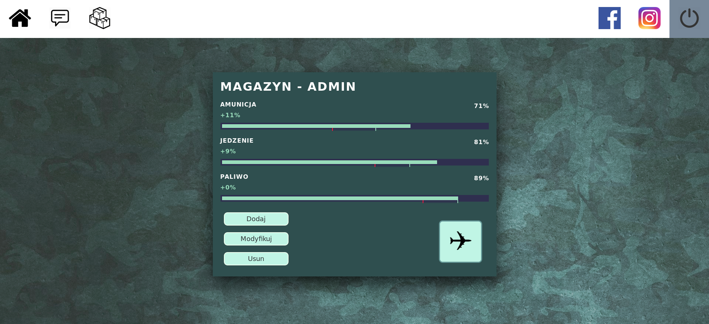

## General info
Simple web app for supply problem.
Algorithm returns number of planes neccesary to supply created/customized things and fill these planes in 100% with additional objects. (optimalization -> priority, weight, warehouse state, level, plane's limit etc... 
Every object has own priority and weight  
Every Warehouse has three levels of state (low, medium, high)
Every plane is weight limited (default: 100, can be changed in script)

## Technologies
Project created with:
* python3
* django

## Application view

